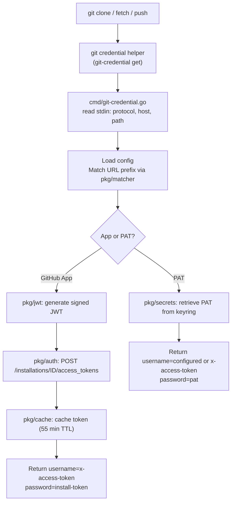

# Architecture

This document is for contributors who want to understand the codebase.

## Package layout

```
gh-app-auth/
├── cmd/           CLI commands (Cobra)
│   ├── root.go          entry point, subcommand registration
│   ├── setup.go         configure credentials
│   ├── list.go          list configured credentials
│   ├── remove.go        delete credentials
│   ├── test.go          verify authentication
│   ├── scope.go         show app installation scope
│   ├── config.go        print config path/contents
│   ├── gitconfig.go     manage git credential helpers
│   ├── migrate.go       move keys to encrypted storage
│   ├── git-credential.go  git credential helper protocol
│   └── debug.go         diagnostic utilities
├── pkg/
│   ├── auth/      GitHub App authentication (JWT → install token)
│   ├── cache/     in-memory token cache with TTL
│   ├── config/    config file loading, saving, validation
│   ├── httpclient/ shared HTTP client with connection pooling
│   ├── jwt/       JWT generation and signing
│   ├── matcher/   URL prefix matching
│   ├── secrets/   OS keyring + filesystem secret storage
│   ├── scope/     installation scope discovery
│   └── logger/    structured diagnostic logging
├── test/
│   ├── e2e/           end-to-end tests
│   ├── integration/   integration tests
│   ├── manual/        manual test scripts
│   └── testutil/      shared test helpers
└── .github/
    ├── actions/       reusable composite actions
    └── workflows/     CI/CD pipelines
```

## Dependency rules

- `pkg/` packages must not import `cmd/`.
- `pkg/cache` and `pkg/jwt` have no internal dependencies (standalone).
- `pkg/matcher` depends on `pkg/config` for the `GitHubApp` struct.
- Only `cmd/` imports Cobra.
- Only `pkg/auth` and `cmd/` make HTTP requests to GitHub.

## Authentication flow



## Token lifecycle

| Token type | Generated by | Validity | Cached |
|-----------|-------------|----------|--------|
| JWT | `pkg/jwt` | ~10 min | No |
| Installation token | GitHub API | 60 min | Yes, 55 min TTL |
| PAT | User-provided | Varies | No (retrieved on demand) |

Installation tokens are cached per-process in `pkg/cache`. Each `git credential`
invocation is a separate process, so the cache only helps commands that make
multiple token requests (e.g., `gh app-auth test`).

## Secret storage

`pkg/secrets` abstracts over two backends:

1. **Keyring** — OS-native encrypted storage. Operations have a 3-second
   timeout to prevent hangs on headless systems.
2. **Filesystem** — plain files under `~/.config/gh/extensions/gh-app-auth/secrets/`
   with mode `0600`. Used as fallback when the keyring is unavailable.

The `config.yml` file records which backend holds each credential
(`private_key_source` / `token_source` field).

## Configuration

`pkg/config` handles loading and saving the YAML config. The config file stores
non-sensitive metadata (App IDs, prefixes, priorities). Secrets are stored
separately via `pkg/secrets`.

Prefix matching is implemented in `pkg/matcher` using `strings.HasPrefix` with
longest-match-wins. Priority is only used in `cmd/git-credential.go` to choose
between an App and a PAT when both match the same URL.
