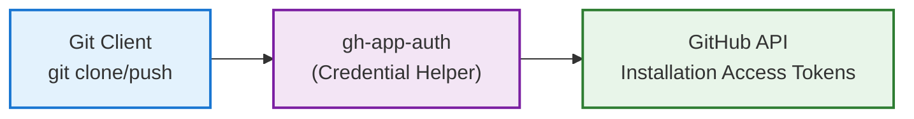
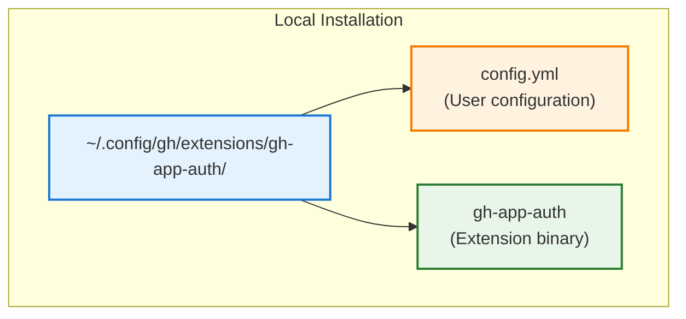

# Architecture Overview

## System Design

The `gh-app-auth` extension implements GitHub App authentication for Git operations through a modular architecture:



## Core Components

### 1. Command Layer (`cmd/`)
- **CLI Interface**: Cobra-based command structure
- **User Commands**: setup, list, remove, test, scope, gitconfig, migrate (all now support GitHub Apps **and** PATs)
- **Git Integration**: credential helper implementation (git-credential) routes requests to either GitHub Apps or PATs using priority logic
- **Automation**: gitconfig command for automatic git configuration (syncs both apps and PATs)

### 2. Authentication Layer (`pkg/auth/`)
- **JWT Generation**: GitHub App JWT token creation
- **Token Exchange**: JWT → Installation access token
- **Credential Provider**: Git credential helper interface

### 3. Configuration Layer (`pkg/config/`)
- **App Management**: GitHub App configurations
- **PAT Management**: PAT entries with name, username (optional), patterns, priority, and secure storage metadata
- **Pattern Matching**: Repository-specific credential selection (apps and PATs share the same routing logic)
- **Persistence**: YAML/JSON configuration storage

### 4. Security Layer (`pkg/secrets/`)
- **Encrypted Key Storage**: OS-native keyring integration (Keychain, Credential Manager, Secret Service) for both private keys and PATs
- **Key Validation**: Private key file permission checks (600/400)
- **PAT Security**: Tokens stored/retrieved through secrets manager, optional username metadata stored in config only
- **Token Security**: Secure in-memory token caching and cleanup
- **Path Validation**: Prevention of path traversal attacks
- **Graceful Degradation**: Automatic fallback to filesystem if keyring unavailable
- See [Encrypted Storage Architecture](ENCRYPTED_STORAGE_ARCHITECTURE.md) for detailed design

## Data Flow

### Authentication Flow
1. **Git Request**: Git requests credentials for repository
2. **Pattern Match**: Extension matches repository to configured credential (GitHub App or PAT) using longest-prefix + priority logic
3. **Credential Issuance**:
   - **GitHub App**: Creates signed JWT using App's private key, exchanges for installation access token, caches token
   - **PAT**: Retrieves token from secure storage (keyring/filesystem), applies optional username override (defaults to `x-access-token`)
4. **Credential Response**: Returns username/password to Git client (PAT username may be custom for Bitbucket)

### Configuration Flow
1. **App Setup**: User configures GitHub App with patterns
2. **Validation**: Extension validates configuration and permissions  
3. **Storage**: Configuration saved to user's config directory
4. **Runtime**: Configuration loaded during authentication

## Security Architecture

### Private Key Security
- File permission validation (600/400 only)
- No key data stored in memory longer than necessary
- Secure path handling with traversal protection

### Token Security
- Installation tokens cached **in-memory only** with 55-minute TTL (GitHub provides 60-min validity)
- Automatic expiration detection on every access
- Background cleanup every minute removes expired tokens
- Memory zeroing on cleanup (best-effort security)
- No persistent token storage (tokens lost on process restart)
- See [Token Caching Documentation](TOKEN_CACHING.md) for detailed technical information

### Configuration Security
- Config files stored with restricted permissions (600)
- Input validation for all configuration values
- Safe path expansion for user directories

## Integration Points

### GitHub CLI Integration
- Uses `go-gh` library for GitHub API access
- Follows GitHub CLI extension conventions
- Compatible with GitHub CLI configuration system

### Git Integration
- Implements Git credential helper protocol
- Supports repository-specific configuration
- Seamless integration with existing Git workflows

### GitHub API Integration
- GitHub App JWT authentication
- Installation access token management
- Repository installation discovery

## Performance Considerations

### Token Caching
- **JWT tokens**: Generated on-demand (~10min validity), not cached
- **Installation tokens**: Cached in memory for 55 minutes
- **Cache hits**: <1ms (memory lookup)
- **Cache miss**: 200-500ms (JWT generation + API call + keyring access)
- **Automatic expiration**: Tokens validated on every access, regenerated when expired

### Pattern Matching
- Longest-prefix matching algorithm
- Priority-based app selection when prefixes tie
- Minimal overhead for credential requests

### Error Handling
- Graceful fallback to other credential helpers
- Comprehensive error reporting with suggestions
- Silent failures for non-matching repositories

## Extensibility

### Plugin Architecture
- Modular package design allows for extensions
- Interface-based authentication providers
- Configurable pattern matching strategies

### Configuration Extension
- YAML/JSON configuration format
- Environment variable overrides
- Multiple GitHub instance support

## Deployment Architecture

### Local Installation


### Git Configuration
```
[credential "https://github.com/myorg"]
    helper = app-auth git-credential
    useHttpPath = true
```

## Monitoring and Observability

### Logging
- Debug logging support via --debug flag
- Error logging with context information
- No logging of sensitive data (keys, tokens)

### Metrics
- Authentication success/failure tracking
- Token cache hit/miss ratios
- Configuration validation metrics

### Troubleshooting
- Built-in test command for authentication validation
- Detailed error messages with remediation suggestions
- Verbose mode for debugging authentication flows
